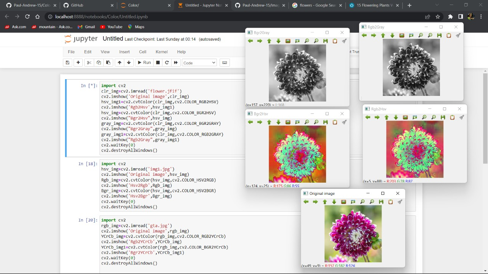
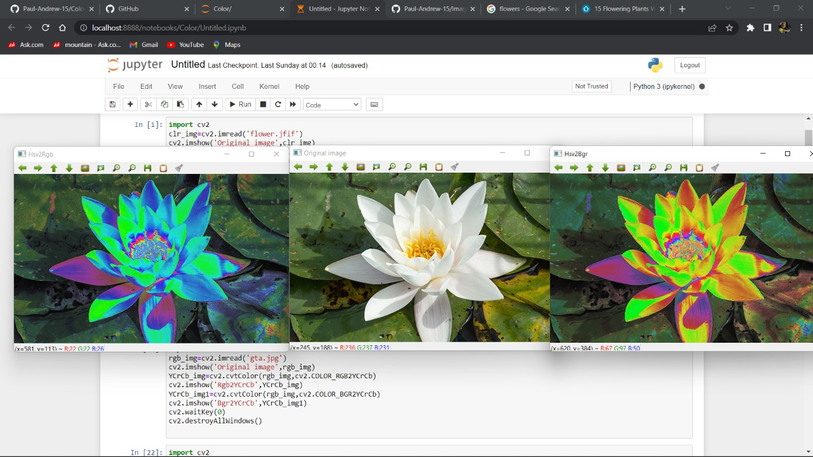
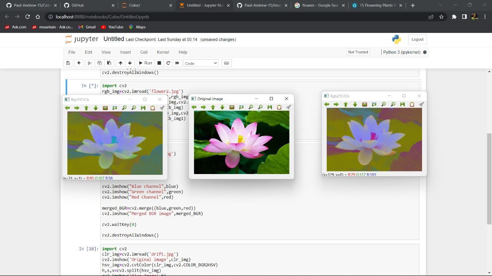
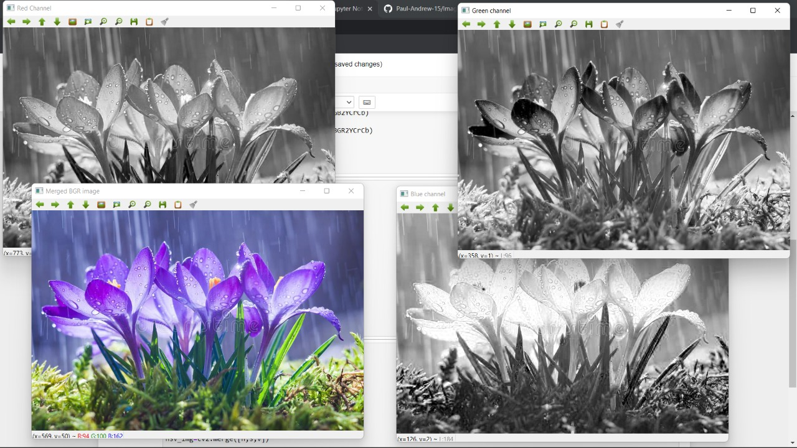
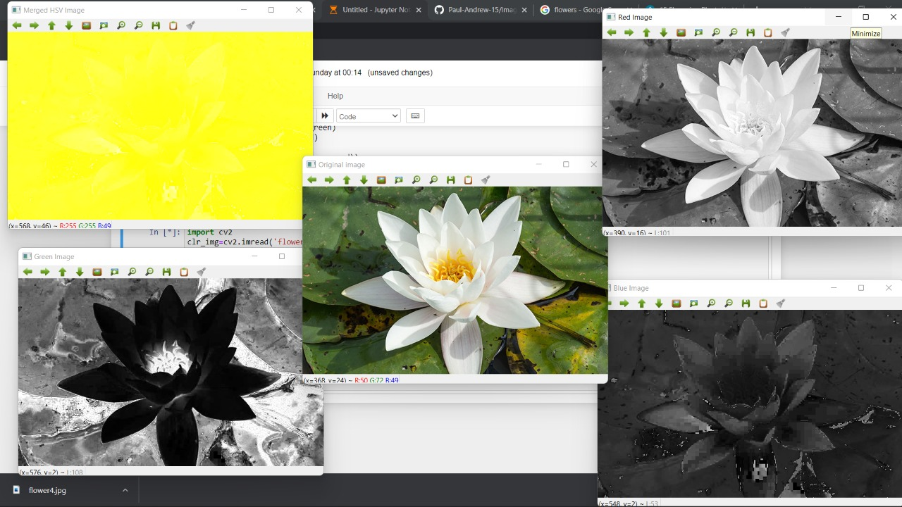

# Color Conversion
## AIM:
To perform the color conversion between RGB, BGR, HSV, and YCbCr color models.

## Software Required:
Anaconda - Python 3.7
# Algorithm:
### Step1:
Open Jupyter Notebook Using Anaconda Navigator.

### Step2:
Create a folder ,in that create a new python kernel and the image to be processed.

### Step3:
Write the codes for the each operation.

### Step4:
Display to original image and the color converted image.

### Step5:
End of program.

# Program:
```python
# Developed By: PAUL ANDREW D
# Register Number: 212221230075.
# i) Convert BGR and RGB to HSV and GRAY
import cv2
clr_img=cv2.imread('muscle.jpg')
cv2.imshow('Original image',clr_img)
hsv_img1=cv2.cvtColor(clr_img,cv2.COLOR_RGB2HSV)
cv2.imshow('Rgb2Hsv',hsv_img1)
hsv_img=cv2.cvtColor(clr_img,cv2.COLOR_BGR2HSV)
cv2.imshow("Bgr2Hsv",hsv_img)
gray_img=cv2.cvtColor(clr_img,cv2.COLOR_BGR2GRAY)
cv2.imshow("Bgr2Gray",gray_img)
gray_img1=cv2.cvtColor(clr_img,cv2.COLOR_RGB2GRAY)
cv2.imshow("Rgb2Gray",gray_img1)
cv2.waitKey(0)
cv2.destroyAllWindows()

# ii)Convert HSV to RGB and BGR
import cv2
hsv_img=cv2.imread('img1.jpg')
cv2.imshow('Original image',hsv_img)
Rgb_img=cv2.cvtColor(hsv_img,cv2.COLOR_HSV2RGB)
cv2.imshow('Hsv2Rgb',Rgb_img)
Bgr_img=cv2.cvtColor(hsv_img,cv2.COLOR_HSV2BGR)
cv2.imshow('Hsv2Bgr',Bgr_img)
cv2.waitKey(0)
cv2.destroyAllWindows()

# iii)Convert RGB and BGR to YCrCb
import cv2
rgb_img=cv2.imread('gta.jpg')
cv2.imshow('Original image',rgb_img)
YCrCb_img=cv2.cvtColor(rgb_img,cv2.COLOR_RGB2YCrCb)
cv2.imshow('Rgb2YCrCb',YCrCb_img)
YCrCb_img1=cv2.cvtColor(rgb_img,cv2.COLOR_BGR2YCrCb)
cv2.imshow('Bgr2YCrCb',YCrCb_img1)
cv2.waitKey(0)
cv2.destroyAllWindows()

# iv)Split and Merge RGB Image
import cv2
clr_img=cv2.imread('Race.jpg')
blue=clr_img[:,:,0]
green=clr_img[:,:,1]
red=clr_img[:,:,2]
cv2.imshow("Blue channel",blue)
cv2.imshow("Green channel",green)
cv2.imshow("Red Channel",red)
merged_BGR=cv2.merge((blue,green,red))
cv2.imshow("Merged BGR image",merged_BGR)
cv2.waitKey(0)
cv2.destroyAllWindows()

# v) Split and merge HSV Image
import cv2
clr_img=cv2.imread('drift.jpg')
cv2.imshow('Original image',clr_img)
hsv_img=cv2.cvtColor(clr_img,cv2.COLOR_BGR2HSV)
h,s,v=cv2.split(hsv_img)
cv2.imshow('Blue Image',h)
cv2.imshow('Green Image',s)
cv2.imshow('Red Image',v)
s.fill(255)
v.fill(255)
hsv_img=cv2.merge([h,s,v])
cv2.imshow("Merged HSV Image",hsv_img)
cv2.waitKey(0)
cv2.destroyAllWindows()
```
# Output:
### i) BGR and RGB to HSV and GRAY


### ii) HSV to RGB and BGR

### iii) RGB and BGR to YCrCb


### iv) Split and merge RGB Image


### v) Split and merge HSV Image



# Result:
Thus the color conversion was performed between RGB, HSV and YCbCr color models.
